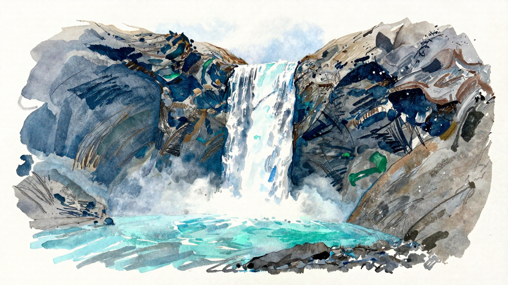
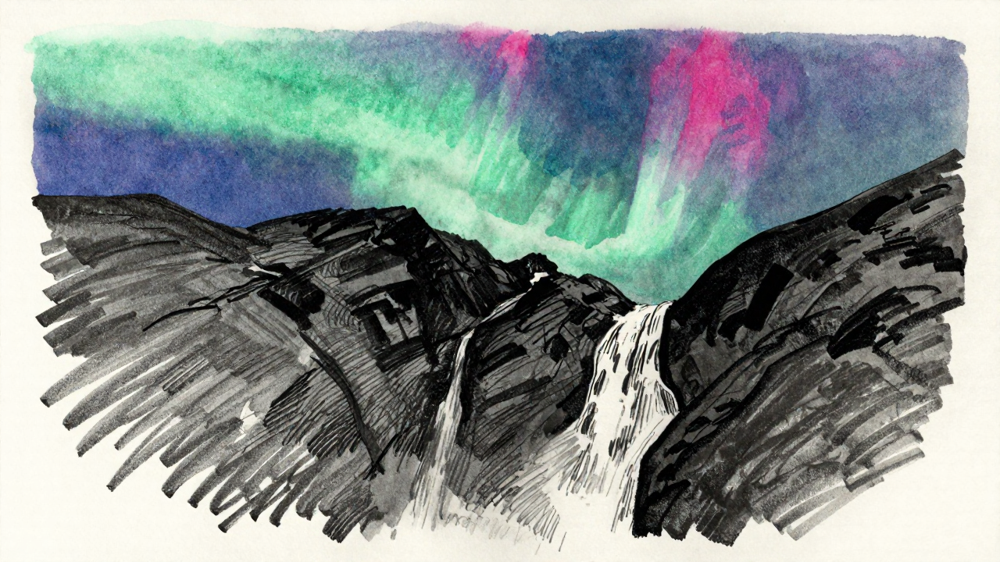

# mflux-forge

A powerful AI image generation toolkit that combines LLM-powered prompt generation with diffusion models and LoRA fine-tuning for creating diverse artistic styles.

Here are some sample images generated with mflux-forge:

### Alpine Cascades

*Generated with pencil watercolor preset using LoRA scales [0.7]*

### Cosmic Skyline

*Generated with pencil watercolor preset using LoRA scales [0.7]*

## Features

- **Multi-Model Support**: FLUX.1-schnell, FLUX.1-dev, FLUX.2-klein-4B, and Z-Image-Turbo models
- **Art Style Presets**: Pencil watercolor, pixel art, digital art, classical painting, and more
- **LLM Integration**: Uses OpenCode or local LLM APIs for intelligent prompt generation
- **LoRA Fine-tuning**: Custom-trained models for specific artistic styles
- **Automatic Upscaling**: Real-ESRGAN integration for high-quality image enhancement
- **Batch Processing**: Generate multiple variations of prompts and styles

<details>
<summary><strong>Prerequisites</strong></summary>

### For Mac Users

1. **Homebrew** (package manager):
   ```bash
   /bin/bash -c "$(curl -fsSL https://raw.githubusercontent.com/Homebrew/install/HEAD/install.sh)"
   ```

2. **Bun** (JavaScript runtime):
   ```bash
   curl -fsSL https://bun.sh/install | bash
   ```
   Restart your terminal after installation.

3. **Python 3.12** (via asdf):
   ```bash
   brew install asdf
   echo '. /opt/homebrew/opt/asdf/libexec/asdf.sh' >> ~/.zshrc
   source ~/.zshrc
   asdf plugin add python
   asdf install python 3.12.12
   asdf local python 3.12.12
   ```

4. **uv** (Python package manager):
   ```bash
   curl -LsSf https://astral.sh/uv/install.sh | sh
   ```
   Restart your terminal after installation.

5. **Git**:
   ```bash
   brew install git
   ```
</details>

## Installation

### Quick Setup (Recommended)

If you have an existing virtual environment (`.venv` directory exists), run:

```bash
chmod +x setup.sh
./setup.sh
```

This will install all remaining dependencies into your existing virtual environment.

If you need to create a virtual environment first:

```bash
python -m venv .venv
source .venv/bin/activate
pip install --upgrade pip
./setup.sh
```

<details>
<summary><strong>Manual Setup</strong></summary>

If you prefer to install manually or are on a different platform:

1. **Clone the repository**:
   ```bash
   git clone <repository-url>
   cd mflux-forge
   ```

2. **Set up Python virtual environment** (if not already done):
   ```bash
   python -m venv .venv
   source .venv/bin/activate
   pip install --upgrade pip
   ```

3. **Install dependencies**:
   ```bash
   bun install
   ```

4. **Install required tools**:

   **MFlux** (AI image generation):
   ```bash
   source .venv/bin/activate  # Activate venv first
   pip install mflux --pre    # Install into virtual environment
   ```

   **Real-ESRGAN NCNN** (for upscaling):
   The setup script automatically downloads the macOS NCNN Vulkan binary (v0.2.5.0) from Real-ESRGAN releases and extracts it to `realesrgan-ncnn/` directory. Includes pre-trained models and a custom upscale script using the native binary for GPU-accelerated performance.

#### Verify Installation

After installation, verify everything is working:

```bash
# Activate virtual environment if needed
source .venv/bin/activate

# Check mflux is installed
mflux-generate --help

# Check upscale script works (run from project root directory)
cd /path/to/your/mflux-forge  # Navigate to project root first
upscale realesrgan-ncnn/input.jpg /tmp/test_output.jpg

# Check bun and dependencies
bun --version
```
</details>

## Configuration

The main configuration is in `config.ts`. You can modify:

- **Image dimensions**: Default 1280x720
- **Model settings**: Steps, model paths
- **LLM endpoints**: Choose between OpenCode or local LLM
- **LoRA configurations**: Add custom style models

## Usage

### Activating the Virtual Environment

Before running Python-based commands, activate your virtual environment:

```bash
source .venv/bin/activate
```

The setup script has already installed mflux and Real-ESRGAN dependencies into this virtual environment.

### Basic Generation

```bash
bun start
```

This will:
1. Generate prompts using the configured LLM
2. Create images for each preset style (pencil watercolor, classic, pixel art, etc.)
3. Automatically upscale all generated images
4. Save outputs to the `images/` directory

### Directory Structure

```
mflux-forge/
├── images/           # Generated images
│   ├── schnell/      # FLUX.1-schnell outputs
│   ├── krea-dev/     # FLUX.1-dev outputs
│   ├── flux2-klein-4b/ # FLUX.2-klein-4B outputs
│   ├── turbo/        # Z-Image-Turbo outputs
│   └── upscaled/     # High-resolution versions
├── prompts/          # Generated prompt files
├── src/              # Source code
└── config.ts         # Configuration
```

## Troubleshooting

### Common Issues

1. **"mflux-generate command not found"**:
   ```bash
   source .venv/bin/activate  # Activate virtual environment first
   pip install mflux --pre    # Install into virtual environment
   ```

2. **Virtual environment issues**:
   ```bash
   # Recreate virtual environment if corrupted
   rm -rf .venv
   python -m venv .venv
   source .venv/bin/activate
   ./setup.sh
   ```

2. **"upscale command not found"**:
   - Ensure the setup script completed successfully and downloaded the NCNN binary to `realesrgan-ncnn/`
   - Check that `realesrgan-ncnn/realesrgan-ncnn-vulkan` binary exists and is executable

3. **Memory issues**:
   - Reduce image dimensions in `config.ts`
   - Use fewer concurrent generations
   - Consider using smaller models

4. **LLM connection issues**:
   - For OpenCode: Ensure internet connection
   - For local LLM: Verify LM Studio server is running on port 1234

### Performance Tips

- Use **FLUX.2-klein-4B** for fastest generation (4 steps) - ultra-compact 4B model
- Use FLUX.1-schnell for balanced speed/quality (7+ steps)
- Reserve FLUX.1-dev for highest quality (20+ steps)
- Z-Image-Turbo works well with LoRAs (7-14 steps)
- Upscaling is GPU-accelerated via Vulkan on macOS (32GB+ RAM recommended)
- **Note**: Run the upscale command from the project root directory (where `realesrgan-ncnn/` is located) for automatic path resolution

## Development

### Adding New Models

1. Add model configuration to `config.ts`
2. Create a new runner in `src/models.ts`
3. Add to presets in `src/presets.ts`
4. Use it in `src/main.ts`

### Adding New LoRAs

1. Download LoRA weights
2. Add configuration to the respective diffusion model settings in `config.ts`
3. Create or modify presets to use the new LoRA

## Model References

This project uses the following AI models and LoRAs, all available on Hugging Face:

### Diffusion Models

- [**FLUX.1-schnell**](https://huggingface.co/dhairyashil/FLUX.1-schnell-mflux-v0.6.2-4bit) - Fast generation model (7 steps)
- [**FLUX.1-dev**](https://huggingface.co/filipstrand/FLUX.1-Krea-dev-mflux-4bit) - High-quality generation model (20 steps)
- [**FLUX.2-klein-4B**](https://huggingface.co/black-forest-labs/FLUX.2-klein-4B) - Compact 4B parameter model (4 steps)
- [**Z-Image-Turbo**](https://huggingface.co/filipstrand/Z-Image-Turbo-mflux-4bit) - Turbo generation model (12 steps)

### LoRA Models

- [**Pencil Sketch**](https://huggingface.co/Ttio2/Z-Image-Turbo-pencil-sketch) - Pencil sketch art style
- [**Digital Art**](https://huggingface.co/bunnycore/Z-Art-2.1) - Digital art style (Z-Art-3.safetensors)
- [**Pixel Art**](https://huggingface.co/tarn59/pixel_art_style_lora_z_image_turbo) - Pixel art style
- [**Behind Glass**](https://huggingface.co/Quorlen/Z-Image-Turbo-Behind-Reeded-Glass-Lora) - Reeded glass effect
- [**Classic Painting**](https://huggingface.co/renderartist/Classic-Painting-Z-Image-Turbo-LoRA) - Classical painting style
- [**Anime-Z**](https://huggingface.co/strangerzonehf/Anime-Z) - Anime art style
- [**Technically Color**](https://huggingface.co/renderartist/Technically-Color-Z-Image-Turbo) - Technical color style
- [**Ghibli**](https://huggingface.co/Ttio2/Z-Image-Turbo-Ghibli-Style) - Studio Ghibli animation style

## Acknowledgments

This project builds upon the excellent work of several open-source projects:

- [**MFlux**](https://github.com/filipstrand/mflux) - MLX native implementations of state-of-the-art generative image models
- [**Real-ESRGAN**](https://github.com/xinntao/Real-ESRGAN) - Practical Algorithms for General Image Restoration
- [**OpenCode**](https://github.com/anomalyco/opencode) - AI-powered code assistance and generation

## License

MIT License - see LICENSE file for details.

---

**Note**: This project requires significant computational resources. A Mac with **32GB+** RAM (unified memory) is recommended for reasonable generation speeds.
